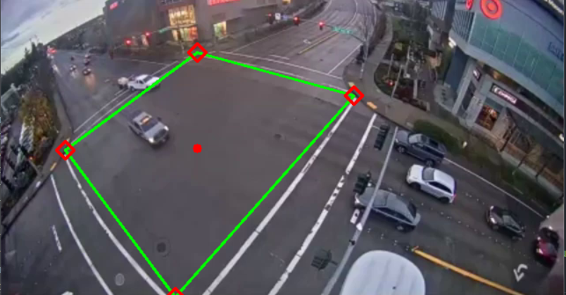

#Traffic Cam Vehicles Counter

A real-time vehicle detection and counting system using YOLO and OpenCV.
The system detects cars, buses, trucks, and motorbikes and counts them as they cross a defined line.

---

##Installation

Main files 

```bash
git clone <repo-url>

pip install opencv-python
```

---
##Note

You have to select the Region Of Interest.
Use Python 3.12.10 Since less and non compatiability of Opencv with higher version of python.
OpenCv version 4.12.0
Yolo nano and small models are best for fast analysis.
For live cam analysis use 
```bash
path=0
```
in main File

---
